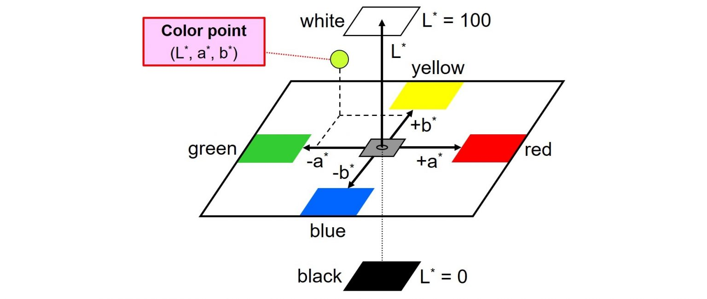
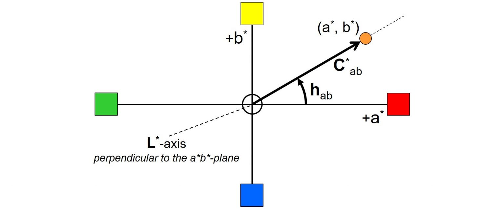
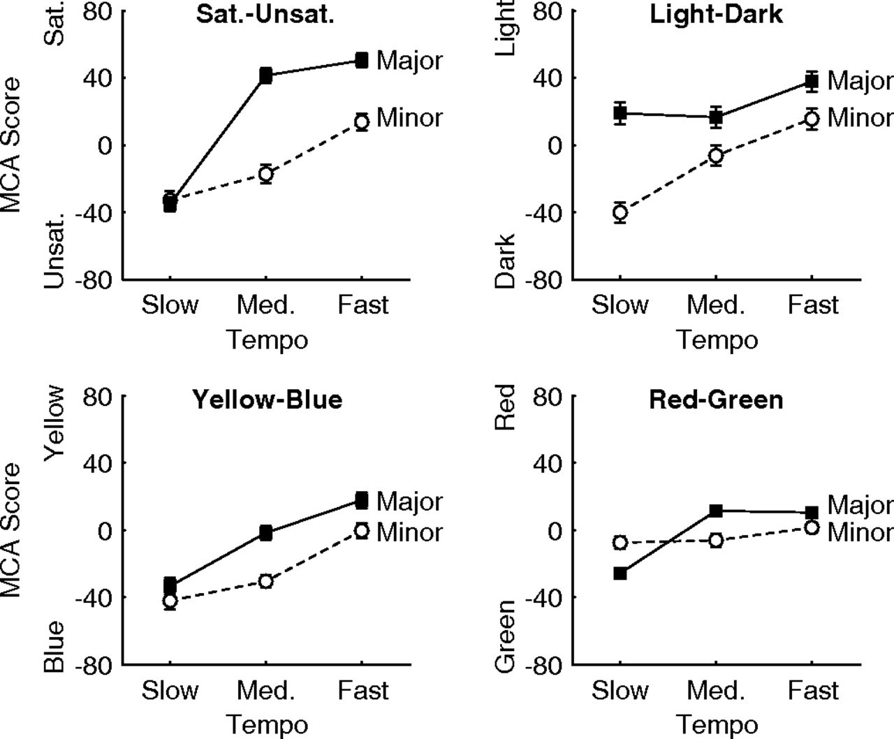
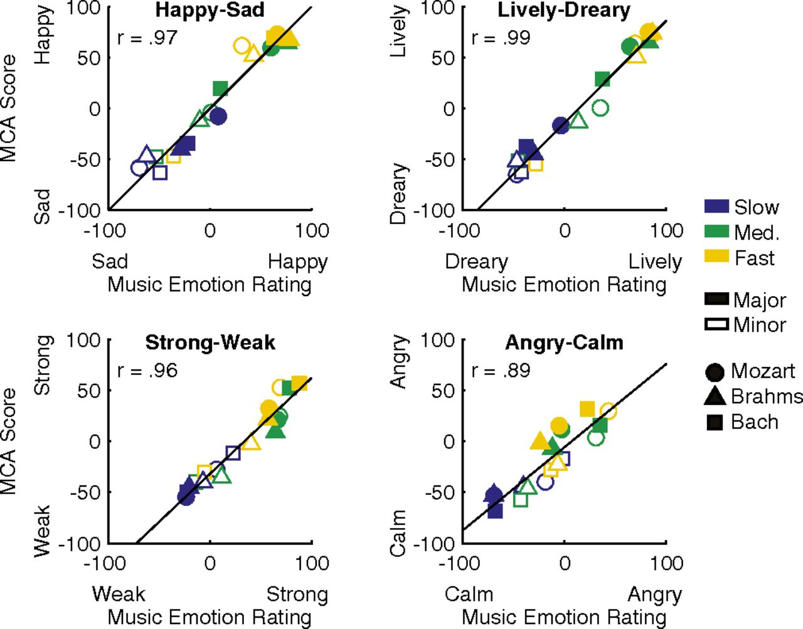

# **Vinylfy**
Vinylfy is a web application which generates a customized vinyl design for users, based on their Spotify listening preferences within the past 4 weeks. 

The application can be accessed from http://vinylfy.herokuapp.com/.

## **User Data**

### **Top Tracks & Artists**
---
Vinylfy uses the [Spotify Web API](https://developer.spotify.com/documentation/web-api/) to obtain a user's top artists or tracks from the past 4 weeks, based on calculated affinity. 

Affinity is a measure of the expected preference a user has for a particular track or artist. It is based on user behavior, including play history, but does not include actions made while in incognito mode. Light or infrequent users of Spotify may not have sufficient play history to generate a full affinity data set.

### **Audio Features**
---
Each audio track in Spotify contains audio feature information for that track. Vinylfy calculates the feature averages for a user's top 11 tracks, including: 

- **Danceability**: How suitable a track is for dancing based on a combination of musical elements including tempo, rhythm stability, beat strength, and overall regularity.

- **Energy**: Measure of intensity and activity. For example, death metal has high energy, while a Bach prelude scores low on the scale. Features contributing to this attribute include dynamic range, perceived loudness, timbre, onset rate, and general entropy.

- **Key**: The key the track is in. Integers map to pitches using standard Pitch Class notation.

- **Loudness**: Loudness of a track in decibels (dB). Values are averaged across the entire track and are useful for comparing relative loudness of tracks. 

- **Mode**: The modality (major or minor) of a track, the type of scale from which its melodic content is derived.

- **Speechiness**: The presence of spoken words in a track.

- **Acousticness**: A confidence measure of whether the track is acoustic.

- **Instrumentalness**: Whether a track contains no vocals. "Ooh" and "aah" sounds are treated as instrumental in this context. 

- **Liveness**: Detects the presence of an audience in the recording. Higher liveness values represent an increased probability that the track was performed live.

- **Valence**: The musical positiveness conveyed by a track. Tracks with high valence sound more positive (e.g. happy, cheerful, euphoric), while tracks with low valence sound more negative (e.g. sad, depressed, angry).

- **Tempo**: Overall estimated tempo of a track in beats per minute (BPM).

## **Generated Design**

### **Vinyl Cover Colour**
---
The colour of a user's vinyl cover is generated based on their most listened to genre, calculated from a user's top 10 artists.

Inspired by reasearch and genre-visualization data from
[Visualising Music The Problems With Genre Classification](https://mastersofmedia.hum.uva.nl/blog/2011/04/26/visualising-music-the-problems-with-genre-classification/#:~:text=Rock%20is%20red%2C%20metal%20is,Light%20grey%20vertices%20are%20unclassified), the following colour-genre assignments were developed:
-  `Purple`: R&B
-  `Lavender`: Classical, Opera, Piano
-  `Pink`: Jazz, Blues, Bossanova, 
-  `Silver`: Electronic, Dubstep, EDM, Techno, House, Club, Dance, Party
-  `Dark Blue`: Hip-Hop, Rap
-  `Sky Blue`: Pop, K-pop 
-  `Teal`: Ambient
-  `Green`: Alternative, Indie, Indie-pop, Psych
-  `Yellow`: Country, Bluegrass
-  `Orange`: Soul, Funk, Groove
-  `Crimson`: Rock, Punk, Goth, Grindcore, Metal
-  `Brown`: Gospel
-  `Grey`: Other

If a user has multiple top genres, a gradient colour scheme will be applied utilizing colour-assignments from the tied genres.

### **Vinyl Cover Design Accent Colours**
---
An algorithm was developed to generate a personalized colour on the 3-dimensional [CIELAB Colour Space](https://en.wikipedia.org/wiki/CIELAB_color_space), using features such as tempo, mode, and key.

Based on [research from UC Berkeley](https://escholarship.org/uc/item/7px9h0gg), the following colour-genre associations were discovered:

 *Data from Palmer et al. (2013) illustrating the effect of mode and tempo on participant color choices. The four graphs show effects on color saturation, color lightness, and two hue dimensions (yellow vs. blue and red vs. green).*

 *These data from Palmer et al. (2013) show the extremely high correlations between emotion ratings for a given piece of music (x-axis) and the average emotion rating of colors chosen as going well with that piece of music (y-axis) for four different emotion dimensions.*

To summarize, it is shown that:

| Tempo  | Mode  | Saturation  | Light | Blue/Yellow | Green/Red |
|--------|-------|-------------|-------|-------------|-----------|
| Slow   | Minor | Unsaturated | Dark  | Blue        | Green     |
| Slow   | Major | Unsaturated | Light | Blue        | Both      |
| Medium | Minor | Unsaturated | Both  | Blue        | Both      |
| Medium | Major | Saturated   | Light | Both        | Both      |
| Fast   | Minor | Saturated   | Light | Both        | Both      |
| Fast   | Major | Saturated   | Light | Yellow      | Both      |

As well as
- *Higher pitch = lighter colours*

### **Vinyl Disk Colour**
---
Energy colours inspired by energy levels of [colors within the range of visible spectrum](https://www.britannica.com/science/color/The-visible-spectrum)

### **Vinyl Tracklist Outline**
---

The outline of a user's tracklist is generated based on the average loudness of their top 11 tracks.

Lines are generated with the following styles, ranging from least loud (-60 dB) to most loud (0 dB): 
- **Dotted**: -60 dB to -46 dB
- **Dashed**: -45 dB to -31 dB
- **Solid**: -30 dB to -16 dB
- **Double**: -15 dB to 0 dB

